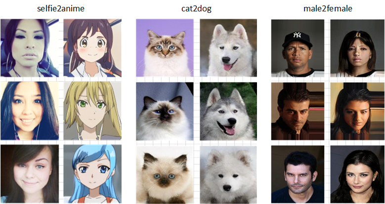

### PatchAttnNCE

Improve PatchNCE with Self-Attention




#### train

``` bash
./traini2i.py \
  --outdir=./training-runs \
  --name=fastae_v10_feat16_attn \
  --dataroot=<dataset path> \
  --netG=models.fastae_v10_networks.Generator \
  --patch_max_shape=16,16 \
  --num_patches=64 \
  --nce_mlp_layers=0 \
  --feature_attn_layers=2 \
  --gpus=1 \
  --batch=8 \
  --snap=50 \
  --kimg=1000
```

#### evaluate checkpoint

``` bash
./gen_images_i2i.py \
  --network=<snapshot path> \
  --dataroot=<dataset path> \
  --outdir=./out/i2iresults
```

#### Acknowledgments
Our codebase build and extends the awesome [projected_gan](https://github.com/autonomousvision/projected_gan)